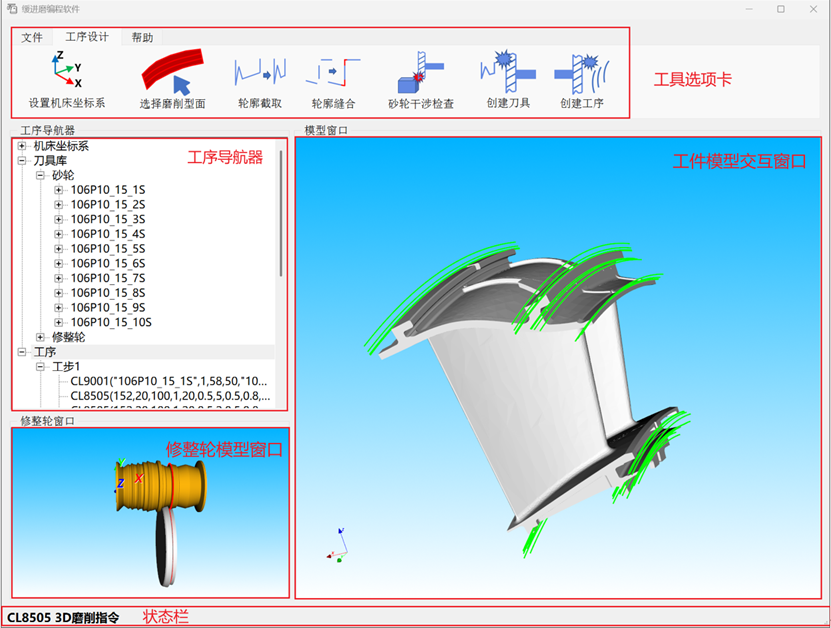

### CFGCAM ——Your own programming accelerator for creep feed grinding!

## Overview
* **Quickly program what you want** CFGCAM1.0.0522 is the latest version of the creep feed grinding off-line programming software.CFGCAM mainly applied to the profile grinding of complex surfaces on blades processed with MÄGERLE creep feed grinding machine tools.
* **Efficient integration of various file formats** CFGCAM supports import of general.stp format part models and import of general.dxf format part dressers by creating a revolved body, as well as export of grinding macro programs by .txt format. CFGCAM also support the import and export of engineering files to achieve rapid deployment of processing tasks.
* **Design of profile grinding tools and tool paths planning** CFGCAM enables you to interactively select the grinding surface and create grinding tools. It realizes the process design of non-continuous surfaces and auxiliary grinding processes through editing the tool's profile. It automatically achieves the matching relationship between the grinding wheel and the dressing wheel, automatically draws the grinding tool path and compiles the grinding program.
* **Forward process design based on tool interference inspection** CFGCAM uses the interference inspection function between the wheel tool and the workpiece to select appropriate wheel diameters and the angle relationship between the tool and the workpiece, thereby preventing over-cutting caused by unreasonable process parameters.
* **Cross platform** CFGCAM runs on Windows, macOS and Linux operating systems.
* **Underlying technology** 
    * **OpenCASCADE** A powerful geometry kernel, supprots graphics algorithms of CFGCAM
    * **VTK** A powerful visualization library, the core component for  CFGCAM's 3D computer graphics rendering
    * **C++** CFGCAM offers a broad C++ API
    * **Qt** Graphical user interface built with Qt
## Installing
Precompiled packages for stable releases are available for Windows, macOS and Linux.
* **For some lower versions platform** requires the configuration of the runtime environment: Run as administrator and execute ./WIN7PATCH/VC_redist.x64.exe
## Operating Instructions
There is a detailed document for operation instructions available under ./操作手册/缓进磨编程软件操作手册.
## Example
* **Project file**There is a project example file of CFGCAM available under ./CFGProject/CFGProject106P10_1.0.0522.cfgproject directory.
* **Workpiece file**There is a workpiece example file of CFGCAM available under ./model/model.stp directory.
* **Dresser file**There is a dresser example file of CFGCAM available under ./dresserdxf/dresserdxf.dxf directory.

## Contact
If you're interested in the project, want to give some feedback or simply get in touch feel free to write to panhongyu-hust@qq.com.

> [!NOTE]
## Lisence
Copyright (c) 2024-2025, TurboCut team of Huazhong University of Science and Technology All rights reserved.
